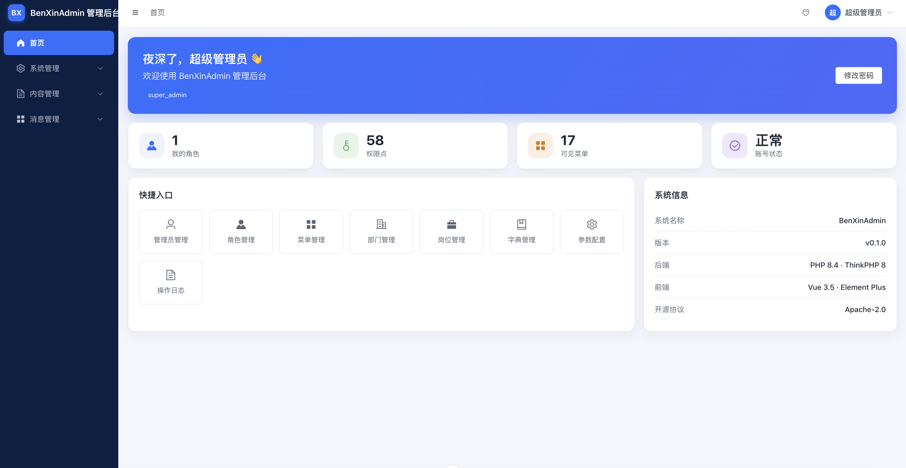

# BenXinAdmin · 管理后台前端（benxin-admin-web）

> [BenXinAdmin](https://gitee.com/binxin-admin/binxin-admin-server) 通用管理后台底座的**配套后台前端**。开源协议：**Apache-2.0**。
>
> 🤖 本项目全程 Vibe Coding 实践（AI 规划 + 编码、人类拍板验收，质量靠规范化基线 + 保真回归 + 安全基线支撑），详见[主仓](https://gitee.com/binxin-admin/binxin-admin-server)。

技术栈：Vue **3.5** + TypeScript + Vite + Element Plus（按需自动导入）+ Pinia + Vue Router + UnoCSS + Axios（统一封装，业务码风格 A）。

## 特性

- **动态路由**：菜单从后端 `profile` 拉取，`import.meta.glob` 映射页面组件。
- **按钮级权限**：`v-permission` 指令，与后端 Casbin enforce 同源。
- **401 分流**：401003 access 过期**单飞 refresh 静默续期重试**，401001/401004 跳登录清会话。
- **配置化 CRUD**：`XTable`（列表/搜索/分页/行操作）+ `XFormDrawer`（编辑表单）+ 分配菜单树形弹窗——即代码生成器前端产物的黄金样板。




## 快速开始

```sh
npm install
cp .env.example .env.development   # 配后端地址（默认 http://127.0.0.1:8801/admin）
npm run dev                        # 开发（热更新）
npm run build                      # 类型检查 + 生产构建
```

- Node 24+；后端先起（`php think run -p 8801`，见[后端仓](https://gitee.com/binxin-admin/binxin-admin-server)）。
- 前端按 `code===0` 判定业务成功；`.env*` 已忽略，勿入库。

## 环境变量

```sh
VITE_API_BASE=http://127.0.0.1:8801/admin
```

## 目录骨架（`src/`）

`api/`（接口调用）、`components/`（XTable / XFormDrawer / XEditor / XUpload 等配置化组件）、`directives/`（`v-permission`）、`layouts/`、`router/`（动态路由）、`stores/`（Pinia）、`utils/`（Axios 封装 / 主题）、`types/`（自动生成类型声明）。

## 许可证

[Apache-2.0](LICENSE)。完整文档见[后端主仓](https://gitee.com/binxin-admin/binxin-admin-server) `docs/ARCHITECTURE.md`。
