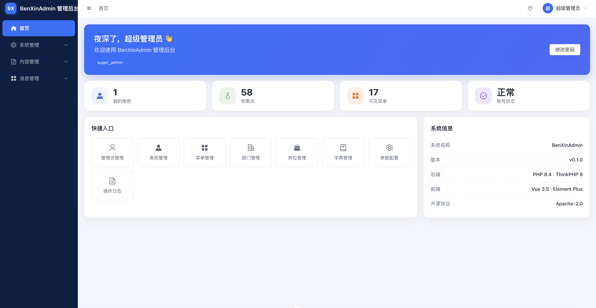
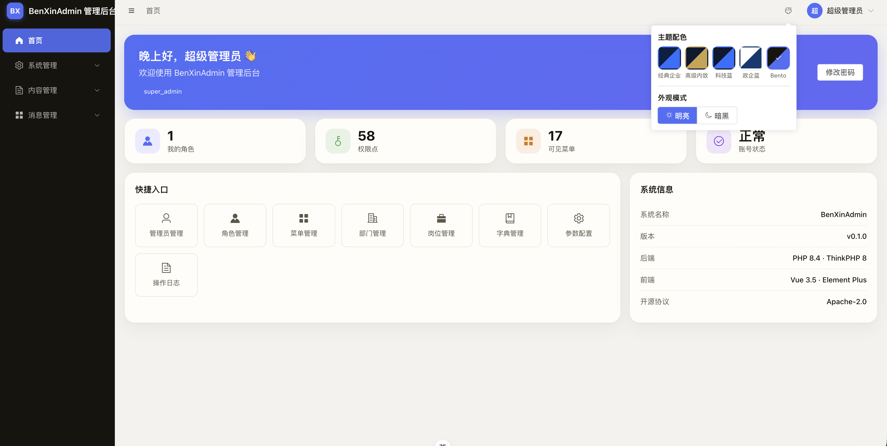

# BenXinAdmin · 管理后台前端（benxin-admin-web）

> [BenXinAdmin](https://gitee.com/binxin-admin/binxin-admin-server) 通用管理后台底座的**配套后台前端**。开源协议：**Apache-2.0**。
>
> 🤖 本项目全程 Vibe Coding 实践（AI 规划 + 编码、人类拍板验收，质量靠规范化基线 + 保真回归 + 安全基线支撑），详见[主仓](https://gitee.com/binxin-admin/binxin-admin-server)。

技术栈：Vue **3.5** + TypeScript + Vite + Element Plus（按需自动导入）+ Pinia + Vue Router + UnoCSS + Axios（统一封装，业务码风格 A）。

## 特性

- **动态路由**：菜单从后端 `profile` 拉取，`import.meta.glob` 映射页面组件。
- **按钮级权限**：`v-permission` 指令，与后端 Casbin enforce 同源。
- **401 分流**：401003 access 过期**单飞 refresh 静默续期重试**，401001/401004 跳登录清会话。
- **配置化 CRUD**：`XTable`（列表/搜索/分页/行操作）+ `XFormDrawer`（编辑表单）+ 分配菜单树形弹窗——即代码生成器前端产物的黄金样板。





## 快速开始

```sh
npm install
cp .env.example .env.development   # 配后端地址（默认 http://127.0.0.1:8801/admin）
npm run dev                        # 开发（热更新）
npm run build                      # 类型检查 + 生产构建
```

- Node 24+；后端先起（`php think run -p 8801`，见[后端仓](https://gitee.com/binxin-admin/binxin-admin-server)）。
- 前端按 `code===0` 判定业务成功；`.env*` 已忽略，勿入库。

## 环境变量

```sh
VITE_API_BASE=http://127.0.0.1:8801/admin
```

## 目录骨架（`src/`）

`api/`（接口调用）、`components/`（XTable / XFormDrawer / XEditor / XUpload 等配置化组件）、`directives/`（`v-permission`）、`layouts/`、`router/`（动态路由）、`stores/`（Pinia）、`utils/`（Axios 封装 / 主题）、`types/`（自动生成类型声明）。

## 依赖与安全说明

### VOD 客户端直传 SDK（`vod-js-sdk-v6`）的 npm audit 告警

素材模块的大视频「客户端直传」链路引入腾讯云官方 **`vod-js-sdk-v6`**（MIT，可商用）。`npm audit` 会报 **3 个告警（1 moderate + 2 high）**，现状诚实说明如下：

- **告警全部在该 SDK 捆绑的嵌套依赖，非项目顶层依赖**：
  - `vod-js-sdk-v6 → axios@0.21.4`（2 high：原型污染 / SSRF 等）——项目**顶层 `axios@1.17.0` 干净、不受影响**；
  - `vod-js-sdk-v6 → uuid@3.4.0`（1 moderate：`v3/v5` buffer 边界检查缺失）。
- **无干净修复版**：`npm audit fix --force` 会把 `vod-js-sdk-v6` 破坏性降级到 `0.0.1`，不可取；告警源于腾讯官方 SDK 的上游依赖选择，需等其升级。

**缓解措施（攻击面极小）：**

- **懒加载隔离**：`vod-js-sdk-v6` 经 `await import('vod-js-sdk-v6')` 动态引入、单独切 chunk，**不进主包**，仅 VOD 上传时按需加载（见 `src/components/XResourceUpload`）。
- **VOD 默认关闭**：纯本地 / OSS / 七牛存储**根本不加载此 SDK**（云存储 / VOD 为可选扩展，详见[后端仓 · 素材存储部署指南](https://gitee.com/binxin-admin/binxin-admin-server#-素材存储部署指南)）。
- **admin 受控 + 固定端点**：仅后台管理员鉴权后使用，请求固定腾讯云 VOD 端点，不接收用户可控 URL。

> 据实标注此告警与缓解，符合「Vibe Coding 透明自证」——把已知风险讲清、说明攻击面为何可控，而非隐藏。建议持续关注 SDK 上游更新。

## 许可证

[Apache-2.0](LICENSE)。完整文档见[后端主仓](https://gitee.com/binxin-admin/binxin-admin-server) `docs/ARCHITECTURE.md`。
